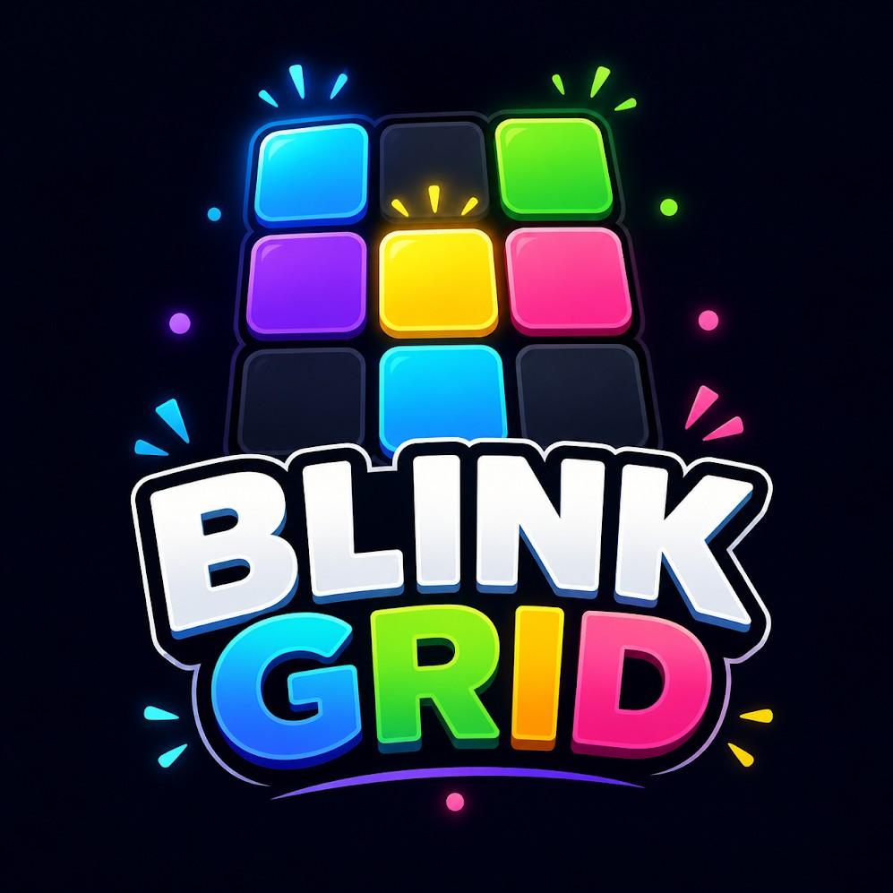
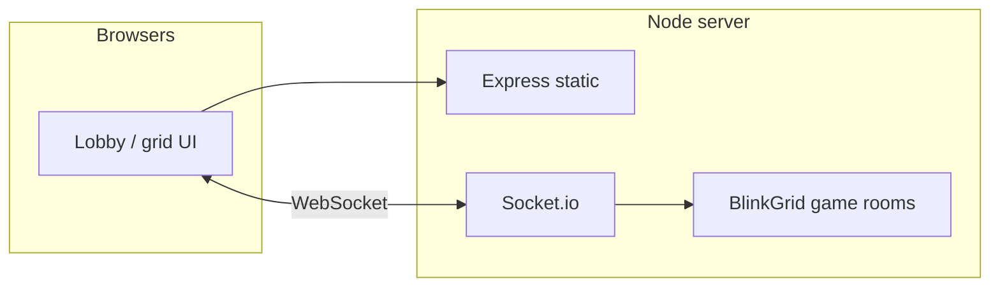

<!-- BlinkGrid — README styled to match the in-app theme: slate night, electric blue → violet glow -->

<p align="center">
  
</p>

<p align="center">
  <strong>Tap fast. Claim tiles. Win together.</strong><br />
  <sub>A tiny real-time multiplayer reaction game — random blinks on a shared grid, first tap wins the tile.</sub>
</p>

<p align="center">
  
  
  
  
</p>

---

## Why BlinkGrid?

BlinkGrid is a **browser-first party game**: one room, one grid, everyone races the same blinking tiles. No database — rooms and matches live **in memory** on a single Node server, synced with **Socket.io**. Bigger boards (up to **16×16**) run longer rounds; bots can fill empty seats so small groups still get a full **6-player** feel.

---

## At a glance

| | |
| --- | --- |
| **Stack** | Node.js · Express (static + HTTP) · Socket.io · Vanilla JS client |
| **Client** | `public/` — Poppins + slate UI, Web Audio SFX/BGM, touch-friendly grid |
| **Server** | `lib/blinkGridServer.js` — rooms, spawns, combos, specials, bots |
| **Tests** | Jest — unit, simulation, optional e2e harness |

---

## Special tiles

Same legend as in-game — learn the board at a glance:

| Tile | Meaning |
| --- | --- |
| ✦ | Normal blink — claim for **+1** (combos stack with quick chains) |
| ⚡ | **Double** — **+2** on claim |
| 💣 | **Trap** — **−1** if you grab it |
| ❄️ | **Freeze** — briefly locks **rivals** from tapping |
| 🔥 | **Streak** — spikes your combo ladder |
| 🌀 | **Shuffle** — reassigns who owns which **claimed** tiles |
| 🧲 | **Magnet** — clears nearby pending blinks |

---

## Quick start

```bash
git clone https://github.com/issac8080/BlinkGrid.git
cd BlinkGrid
npm install
npm start
```

Then open **http://localhost:3000** (or the port printed in the terminal). Locally, if `3000` is busy, the server scans for another free port **unless** you set `PORT` explicitly (see below).

### Production (Railway, Render, Heroku, Docker, VPS)

Set **`NODE_ENV=production`**. Your host almost always sets **`PORT`** — the server listens on that **exact** port (no scanning), binds **`0.0.0.0`** by default so the container accepts external traffic, and exposes **`GET /health`** for load balancers.

If the browser loads the UI from a **different origin** than the API (unusual for this single-server app), set **`ALLOWED_ORIGINS`** to a comma-separated list (e.g. `https://myapp.onrender.com`).

| Command | What it does |
| --- | --- |
| `npm start` / `npm run dev` | Run the game server |
| `npm test` | Run the full Jest suite |
| `npm run test:watch` | Watch mode |
| `npm run test:sim` | Heavier simulation test only |

---

## Environment

| Variable | Purpose |
| --- | --- |
| `PORT` | **Unset (local):** try `3000`, then scan a few ports if busy. **Set (PaaS):** listen on this exact port only. |
| `NODE_ENV` | Use `production` behind a reverse proxy (enables `trust proxy`). |
| `BIND_HOST` | Interface to bind (default `0.0.0.0`). Use `127.0.0.1` only if you intentionally want localhost-only. |
| `ALLOWED_ORIGINS` / `CORS_ORIGIN` | Comma-separated origins for Socket.io when not same-origin; `*` allows all. |
| `BLINKGRID_DEBUG=1` | Extra server tap / room logging |

---

## Repository layout

```
BlinkGrid/
├── server.js              # HTTP server + Socket.io attach + port probe
├── lib/
│   └── blinkGridServer.js # Game logic, rooms, bots, ticks
├── public/
│   ├── index.html
│   ├── css/style.css
│   ├── js/app.js
│   ├── js/audio-engine.js
│   └── logo.png           # Brand mark (also favicon / apple touch)
├── tests/
└── package.json
```

---

## Architecture (high level)



---

## Contributing & credits

Built as a focused demo: **no DB**, **no auth** — fork and extend (persistence, accounts, ranked queues) as you like.

**Git / coursework:** After cloning, run once `git config core.hooksPath .githooks` in this repo so only the empty `.githooks` folder is used (avoids global IDE hooks appending extra trailers to your commits).

**Blink Grid** — developed by **Issac Sunny**

- [LinkedIn — Issac Sunny](https://www.linkedin.com/in/issac-sunny/)
- [GitHub — issac8080](https://github.com/issac8080)

<p align="center">
  
</p>

<p align="center"><sub>Play loud, play fair, blink first.</sub></p>
